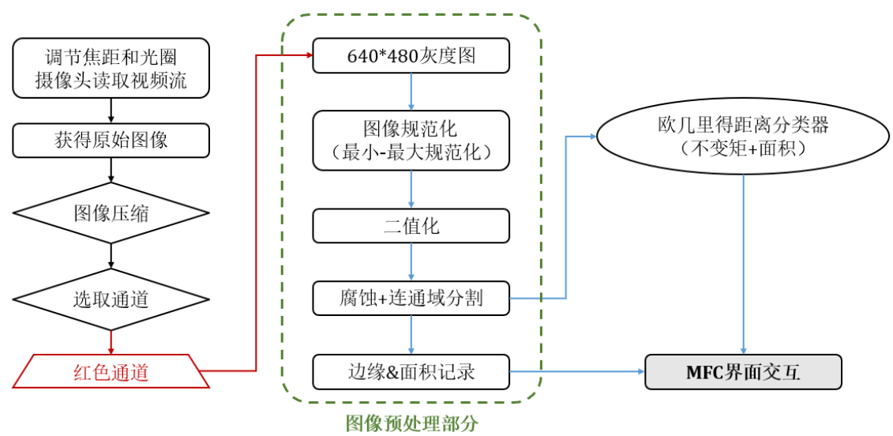
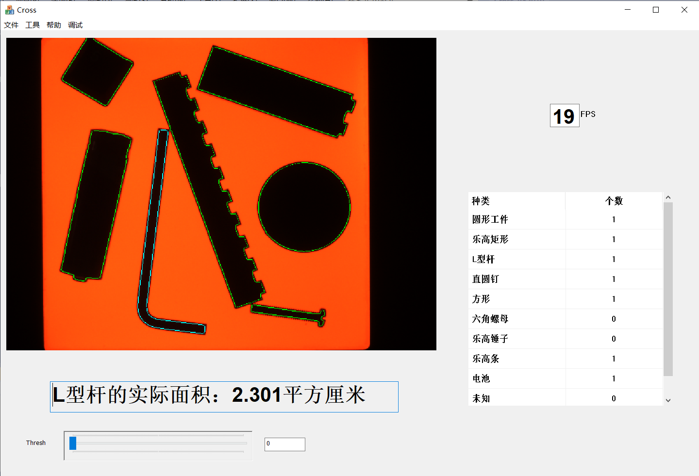

# HUST_AIA_Image_Process_Projectd

本项目为华中科技大学人工智能与自动化学院自动化方向学生图像处理与模式识别课程设计，仅供华中科技大学学生内部参考。

## 项目概述

### 任务描述

- 实现不同形状工件的检测识别（硬币、螺栓、螺钉、螺母、L杆...）
- 实现工件的自动分类、计数、面积测量

### 任务特点与难点

* 图像采集任务
* 提取不变特征检测识别
* 解决工件粘连问题
* 保证实时性

## 实施方案

其中，绿色框内容主要由韦思成负责；绿色框外以及代码格式规范、接口要求、设计模式等主要由房江祎负责。

## 具体效果

[视频展示](https://www.bilibili.com/video/BV1bL4y157g3/)

## 环境依赖
- 集成开发环境使用：VS2019
- GUI使用：MFC
- 摄像机型号：MV-EM120M/C
- [摄像机内容相关详情](http://www.xamv.com/Products/mvemxlqzwg.html)
